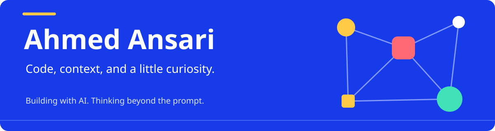
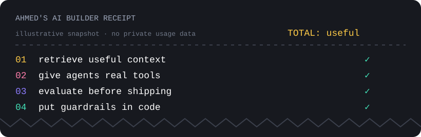

  <a href="https://ahmedansari.me">Portfolio ↗</a> &nbsp;·&nbsp;
  <a href="https://www.linkedin.com/in/ahmed-1-ansari/">LinkedIn</a> &nbsp;·&nbsp;
  <a href="mailto:ahmedraza1ansari@gmail.com">Say hello</a> &nbsp;·&nbsp;
  <a href="https://linktr.ee/ahmed1ansari">Elsewhere</a>

---

I build software that helps people make sense of their information.
Usually that involves retrieval, agents, and connecting things that weren't talking to each other.

> AI where it helps. Regular code where it doesn't.

## 🚀 Things I've built

A home for the things you want to remember. Collect, organize, and chat with your material—with hybrid search, cited answers, and your own model keys. Built for Windows and Linux.

A service desk for a fictional company with very real workflows. Incidents, SLA clocks, changes, releases, and an auditable event trail—built with FastAPI, SQLite, and React.

Less noise on the web. A Chrome ad and tracker blocker that turns EasyList and EasyPrivacy into network and cosmetic filtering, right on your device.

From LLM foundations to production agents. A free AI engineering learning platform with 22 tracks, hands-on lessons, quizzes, and progress tracking.

## 🖥️ My WorkSpace:
|  |  |  |  |  |  |
| --- | --- | --- | --- | --- | --- |

## ⚡ My tech stack

![MCP](https://img.shields.io/badge/MCP-743BDF?style=for-the-badge&logo=data%3Aimage%2Fsvg%2Bxml%3Bbase64%2CPHN2ZyBmaWxsPSIjZmZmZmZmIiBmaWxsLXJ1bGU9ImV2ZW5vZGQiIGhlaWdodD0iMWVtIiBzdHlsZT0iZmxleDpub25lO2xpbmUtaGVpZ2h0OjEiIHZpZXdCb3g9IjAgMCAyNCAyNCIgd2lkdGg9IjFlbSIgeG1sbnM9Imh0dHA6Ly93d3cudzMub3JnLzIwMDAvc3ZnIj48dGl0bGU%2BTW9kZWxDb250ZXh0UHJvdG9jb2w8L3RpdGxlPjxwYXRoIGQ9Ik0xNS42ODggMi4zNDNhMi41ODggMi41ODggMCAwMC0zLjYxIDBsLTkuNjI2IDkuNDRhLjg2My44NjMgMCAwMS0xLjIwMyAwIC44MjMuODIzIDAgMDEwLTEuMThsOS42MjYtOS40NGE0LjMxMyA0LjMxMyAwIDAxNi4wMTYgMCA0LjExNiA0LjExNiAwIDAxMS4yMDQgMy41NCA0LjMgNC4zIDAgMDEzLjYwOSAxLjE4bC4wNS4wNWE0LjExNSA0LjExNSAwIDAxMCA1LjlsLTguNzA2IDguNTM3YS4yNzQuMjc0IDAgMDAwIC4zOTNsMS43ODggMS43NTRhLjgyMy44MjMgMCAwMTAgMS4xOC44NjMuODYzIDAgMDEtMS4yMDMgMGwtMS43ODgtMS43NTNhMS45MiAxLjkyIDAgMDEwLTIuNzU0bDguNzA2LTguNTM4YTIuNDcgMi40NyAwIDAwMC0zLjU0bC0uMDUtLjA0OWEyLjU4OCAyLjU4OCAwIDAwLTMuNjA3LS4wMDNsLTcuMTcyIDcuMDM0LS4wMDIuMDAyLS4wOTguMDk3YS44NjMuODYzIDAgMDEtMS4yMDQgMCAuODIzLjgyMyAwIDAxMC0xLjE4bDcuMjczLTcuMTMzYTIuNDcgMi40NyAwIDAwLS4wMDMtMy41Mzd6Ij48L3BhdGg%2BPHBhdGggZD0iTTE0LjQ4NSA0LjcwM2EuODIzLjgyMyAwIDAwMC0xLjE4Ljg2My44NjMgMCAwMC0xLjIwNCAwbC03LjExOSA2Ljk4MmE0LjExNSA0LjExNSAwIDAwMCA1LjkgNC4zMTQgNC4zMTQgMCAwMDYuMDE2IDBsNy4xMi02Ljk4MmEuODIzLjgyMyAwIDAwMC0xLjE4Ljg2My44NjMgMCAwMC0xLjIwNCAwbC03LjExOSA2Ljk4MmEyLjU4OCAyLjU4OCAwIDAxLTMuNjEgMCAyLjQ3IDIuNDcgMCAwMTAtMy41NGw3LjEyLTYuOTgyeiI%2BPC9wYXRoPjwvc3ZnPg%3D%3D&logoColor=white)

### 🤖 Agents & orchestration

![LlamaIndex](https://img.shields.io/badge/LlamaIndex-B833D0?style=for-the-badge&logo=data%3Aimage%2Fsvg%2Bxml%3Bbase64%2CPHN2ZyBmaWxsPSIjZmZmZmZmIiBmaWxsLXJ1bGU9ImV2ZW5vZGQiIGhlaWdodD0iMWVtIiBzdHlsZT0iZmxleDpub25lO2xpbmUtaGVpZ2h0OjEiIHZpZXdCb3g9IjAgMCAyNCAyNCIgd2lkdGg9IjFlbSIgeG1sbnM9Imh0dHA6Ly93d3cudzMub3JnLzIwMDAvc3ZnIj48dGl0bGU%2BTGxhbWFJbmRleDwvdGl0bGU%2BPHBhdGggZD0iTTE1Ljg1NSAxNy4xMjJjLTIuMDkyLjkyNC00LjM1OC41NDUtNS4yMy4yNCAwIC4yMS0uMDEuODU3LS4wNDggMS43OC0uMDM4LjkyNC0uMzMyIDEuNTA3LS40NzUgMS42ODQuMDE2LjU3Ny4wMjkgMS44MzctLjA0NyAyLjI2YTEuOTMgMS45MyAwIDAxLS40NzYuOTE0SDguMjk1Yy4xMTQtLjU3Ny41NTUtLjk0Ni43NjEtMS4wNTguMTE0LTEuMTkzLS4xMS0yLjIyOS0uMjM4LTIuNTk3LS4xMjYuNDQ5LS40MzcgMS40OS0uNjY1IDIuMDY4YTYuNDE4IDYuNDE4IDAgMDEtLjcxMyAxLjI5OWgtLjk1MWMtLjA0OC0uNTc4LjI3LS43Ny40NzUtLjc3LjA5NS0uMTc3LjMyMy0uNzMxLjQ3Ni0xLjU0LjE1Mi0uODA3LS4wNjQtMi4zMjQtLjE5LTIuOTgxdi0yLjA2OGMtMS41MjItLjgxOC0yLjA5Mi0xLjYzNi0yLjQ3My0yLjU1LS4zMDQtLjczLS4yMjItMS44NDMtLjE0Mi0yLjMwOC0uMDk2LS4xNzYtLjM3My0uNjI1LS40NzYtMS4yNS0uMTQyLS44NjYtLjA2My0xLjQ5MSAwLTEuODI4LS4wOTUtLjA5Ni0uMjg1LS41ODctLjI4NS0xLjc4IDAtMS4xOTIuMzQ5LTEuODExLjUyMy0xLjk3MnYtLjUyOWMtLjY2Ni0uMDQ4LTEuMzMxLS4zMzYtMS43MTItLjcyMS0uMzgtLjM4NS0uMDk1LS45NjIuMTQzLTEuMTU0LjIzOC0uMTkzLjQ3NS0uMDQ5LjgwOC0uMTQ1LjMzMy0uMDk2LjYxOC0uMTkyLjc2LS40OEM0LjUxMiAxLjQwMyA0LjI4Ny40NDggNC4xNiAwYy41Ny4wNzcuOTM1LjU3NyAxLjA0Ni44MThWMGMuNzEzLjMzNyAxLjk5NyAxLjE1NCAyLjQyNSAyLjkzNC4zNDIgMS40MjQuNTg2IDQuNDA5LjY2NSA1LjcyMyAxLjgyMy4wMTYgNC4xMzctLjI2IDYuMjI5LjE5MyAxLjkwMS40MTIgMi43NTcgMS4yNSAzLjc1NSAxLjI1Ljk5OSAwIDEuNTctLjU3NyAyLjI4Mi0uMDk2LjcxNC40ODEgMS4wOTQgMS44MjguOTk5IDIuODM4LS4wNzYuODA4LS42OTcgMS4wNzQtLjk5OCAxLjEwNi0uMzggMS4yNyAwIDIuNDg1LjIzNyAyLjkzNHYxLjgyN2MuMTExLjE2LjMzMy42NTUuMzMzIDEuMzQ3IDAgLjY5My0uMjIyIDEuMTU0LS4zMzMgMS4yOTkuMTkgMS4wNzctLjA4IDIuMTgtLjIzOCAyLjU5N2gtMS4yODNjLjE1Mi0uMzg1LjQxMi0uNDgxLjUyMy0uNDgxLjIyOC0xLjE5My4wNjMtMi4yOTMtLjA0OC0yLjY5My0uNzIyLS40MjQtMS4xODgtMS4xNy0xLjMzMS0xLjQ5MS4wMTYuMjcyLS4wMjkgMS4wMjktLjMzMyAxLjg3NS0uMzA0Ljg0Ny0uNzYgMS4zNDctLjk1IDEuNDkxdjEuMDFoLTEuMjg0YzAtLjYxNS4zNDgtLjczNy41MjMtLjcyMS4yMjItLjQuNzYtMS4wMS43Ni0yLjIxMiAwLTEuMDE1LS43MTMtMS40OTItMS4yMzYtMi40MDUtLjI0OC0uNDM0LS4xMjctLjk3OC0uMDQ3LTEuMjAzeiI%2BPC9wYXRoPjwvc3ZnPg%3D%3D&logoColor=white)
![CrewAI](https://img.shields.io/badge/CrewAI-D94A43?style=for-the-badge&logo=data%3Aimage%2Fsvg%2Bxml%3Bbase64%2CPHN2ZyBmaWxsPSIjZmZmZmZmIiBmaWxsLXJ1bGU9ImV2ZW5vZGQiIGhlaWdodD0iMWVtIiBzdHlsZT0iZmxleDpub25lO2xpbmUtaGVpZ2h0OjEiIHZpZXdCb3g9IjAgMCAyNCAyNCIgd2lkdGg9IjFlbSIgeG1sbnM9Imh0dHA6Ly93d3cudzMub3JnLzIwMDAvc3ZnIj48dGl0bGU%2BQ3Jld0FJPC90aXRsZT48cGF0aCBjbGlwLXJ1bGU9ImV2ZW5vZGQiIGQ9Ik0xOC4yMTMgMTQuMDU3bC4wNTQtLjA3MS4xMzItLjE3NmMuMTU4LS4yMTIuMzExLS40MjcuNDYyLS42NDVhLjc0OC43NDggMCAwMTEuMjU2LjAzMSAxLjQzOCAxLjQzOCAwIDAxLjE1OCAxLjEwM2wtLjEzNi41MjItLjA0LjE1MmE3LjkzNSA3LjkzNSAwIDAxLTIuNDY0IDMuODYzYy0uNTcyLjQ5LTEuMTM4LjkzOC0xLjc3NCAxLjMwNi0uNDI3LjI0Ny0uODU3LjQ5NS0xLjMwMy43MDZhOS42MjggOS42MjggMCAwMS0zLjE1NS45NzRjLS43NDguMDk3LTEuNTAzLjEzNi0yLjI1Ny4xMTZhNi41MzEgNi41MzEgMCAwMS0zLjgzNy0xLjQyMyA1Ljk2NyA1Ljk2NyAwIDAxLTIuMDcxLTMuNDk0IDguODU5IDguODU5IDAgMDEtLjA4NS0zLjA4IDEzLjU2IDEzLjU2IDAgMDExLjU0LTQuNTY4IDE5LjcgMTkuNyAwIDAxMi4yMTItMy4zNDggMTMuMzgyIDEzLjM4MiAwIDAxMy4wODgtMi43NTkgNy45IDcuOSAwIDAxMi44MzItMS4xNDFjMS4zMDctLjI0NSAyLjQzNC4yMDcgMy40ODEuOTMzYTYuMjIxIDYuMjIxIDAgMDExLjgwNiAxLjg5M2MuNDIzLjc2Ni41MzYgMS42NjcuMzE0IDIuNTE0YTEyLjM5IDEyLjM5IDAgMDEtLjk5IDIuNjdsLS4yMjMuNDk3Yy0uMzIxLjcxMy0uNjQyIDEuNDI2LS45NyAyLjEzOGEuNzYyLjc2MiAwIDAxLS45Ny40NjYgMy4zOSAzLjM5IDAgMDEtMi4yODMtMi40OWMtLjA5NS0uODMuMDQtMS42NjkuMzktMi40MjZsLjAyLS4wNTRjLjIzMi0uNTk0LjQ4NS0xLjE4Ljc0MS0xLjc2NGwuMDMtLjA2NWEzMjYuNDk4IDMyNi40OTggMCAwMS4zNy0uODQxbC4wMi0uMDQ3YS41MzMuNTMzIDAgMDAtLjIwNC0uNzQyIDIuMzQ4IDIuMzQ4IDAgMDAtMS4yLjcwMmwtLjAzNi4wMzYtLjAwMS4wMDEtLjAyOC4wMjhhMjYuMDY1IDI2LjA2NSAwIDAwLTEuNTUgMS43MDIgMjEuNTYgMjEuNTYgMCAwMC0yLjYxOCA0LjE4NCA3LjU5IDcuNTkgMCAwMC0uODE2IDIuNzUzIDcuMDQyIDcuMDQyIDAgMDAuMDcgMi4yMTkgMi4wNTYgMi4wNTYgMCAwMDEuOTM0IDEuNzE1YzEuODAxLjEgMy41OS0uMzYzIDUuMTE2LTEuMzI4LjU4Mi0uNCAxLjE0MS0uODMxIDEuNjc1LTEuMjkzLjQ4MS0uNDU2LjkxLS45NTEgMS4zMS0xLjQ3em0xLjE5OC0zLjI3NGEyLjc1MyAyLjc1MyAwIDAxMi40NyAxLjM1NWMuNDgzLjgwNi42MjIgMS43NzIuMzg1IDIuNjhsLS4xMzYuNTIyYTkuOTk0IDkuOTk0IDAgMDEtMy4xNTYgNS4wNThjLS42MDUuNTE3LTEuMjgzIDEuMDYyLTIuMDgzIDEuNTI0bC0uMDI4LjAxN2MtLjQwMi4yMzItLjg4NC41MTEtMS4zOTguNzU2LTEuMTkuNjAyLTIuNDc1Ljk5Ny0zLjc5OCAxLjE2Ny0uODU0LjExMS0xLjcxNi4xNTUtMi41NzcuMTMySDkuMDcyYTguNTg4IDguNTg4IDAgMDEtNS4wNDYtMS44N2wtLjAxMi0uMDEtLjAxMi0uMDFBOC4wMjQgOC4wMjQgMCAwMTEuMjIgMTcuNDJhMTAuOTE2IDEwLjkxNiAwIDAxLS4xMDItMy43NzlBMTUuNjIyIDE1LjYyMiAwIDAxMi44OCA4LjRhMjEuNzU4IDIxLjc1OCAwIDAxMi40MzItMy42NzggMTUuNDQgMTUuNDQgMCAwMTMuNTYtMy4xODJBOS45NTggOS45NTggMCAwMTEyLjQ0LjEwNGguMDA0bC4wMDMtLjAwMmMyLjA1Ny0uMzg0IDMuNzQzLjM3NCA1LjAyNCAxLjI2YTguMjggOC4yOCAwIDAxMi4zOTUgMi41MTNsLjAyNC4wNC4wMjMuMDQyYTUuNDc0IDUuNDc0IDAgMDEuNTA4IDQuMDEyYy0uMjM5Ljk3LS41NzcgMS45MTQtMS4wMSAyLjgxNHoiPjwvcGF0aD48L3N2Zz4%3D&logoColor=white)

### 🧠 Models & AI tools

![OpenAI](https://img.shields.io/badge/OpenAI-008568?style=for-the-badge&logo=data%3Aimage%2Fsvg%2Bxml%3Bbase64%2CPHN2ZyBmaWxsPSIjZmZmZmZmIiBmaWxsLXJ1bGU9ImV2ZW5vZGQiIGhlaWdodD0iMWVtIiBzdHlsZT0iZmxleDpub25lO2xpbmUtaGVpZ2h0OjEiIHZpZXdCb3g9IjAgMCAyNCAyNCIgd2lkdGg9IjFlbSIgeG1sbnM9Imh0dHA6Ly93d3cudzMub3JnLzIwMDAvc3ZnIj48dGl0bGU%2BT3BlbkFJPC90aXRsZT48cGF0aCBkPSJNOS4yMDUgOC42NTh2LTIuMjZjMC0uMTkuMDcyLS4zMzMuMjM4LS40MjhsNC41NDMtMi42MTZjLjYxOS0uMzU3IDEuMzU2LS41MjMgMi4xMTctLjUyMyAyLjg1NCAwIDQuNjYyIDIuMjEyIDQuNjYyIDQuNTY2IDAgLjE2NyAwIC4zNTctLjAyNC41NDdsLTQuNzEtMi43NTlhLjc5Ny43OTcgMCAwMC0uODU2IDBsLTUuOTcgMy40NzN6bTEwLjYwOSA4LjhWMTIuMDZjMC0uMzMzLS4xNDMtLjU3LS40MjktLjczN2wtNS45Ny0zLjQ3MyAxLjk1LTEuMTE4YS40MzMuNDMzIDAgMDEuNDc2IDBsNC41NDMgMi42MTdjMS4zMDkuNzYgMi4xODkgMi4zNzggMi4xODkgMy45NDggMCAxLjgwOC0xLjA3IDMuNDczLTIuNzYgNC4xNjN6TTcuODAyIDEyLjcwM2wtMS45NS0xLjE0MmMtLjE2Ny0uMDk1LS4yMzktLjIzOC0uMjM5LS40MjhWNS44OTljMC0yLjU0NSAxLjk1LTQuNDcyIDQuNTkxLTQuNDcyIDEgMCAxLjkyNy4zMzMgMi43MTIuOTI4TDguMjMgNS4wNjdjLS4yODUuMTY2LS40MjguNDA0LS40MjguNzM3djYuODk4ek0xMiAxNS4xMjhsLTIuNzk1LTEuNTd2LTMuMzNMMTIgOC42NThsMi43OTUgMS41N3YzLjMzTDEyIDE1LjEyOHptMS43OTYgNy4yM2MtMSAwLTEuOTI3LS4zMzItMi43MTItLjkyN2w0LjY4Ni0yLjcxMmMuMjg1LS4xNjYuNDI4LS40MDQuNDI4LS43Mzd2LTYuODk4bDEuOTc0IDEuMTQyYy4xNjcuMDk1LjIzOC4yMzguMjM4LjQyOHY1LjIzM2MwIDIuNTQ1LTEuOTc0IDQuNDcyLTQuNjE0IDQuNDcyem0tNS42MzctNS4zMDNsLTQuNTQ0LTIuNjE3Yy0xLjMwOC0uNzYxLTIuMTg4LTIuMzc4LTIuMTg4LTMuOTQ4QTQuNDgyIDQuNDgyIDAgMDE0LjIxIDYuMzI3djUuNDIzYzAgLjMzMy4xNDMuNTcxLjQyOC43MzhsNS45NDcgMy40NDktMS45NSAxLjExOGEuNDMyLjQzMiAwIDAxLS40NzYgMHptLS4yNjIgMy45Yy0yLjY4OCAwLTQuNjYyLTIuMDIxLTQuNjYyLTQuNTE5IDAtLjE5LjAyNC0uMzguMDQ3LS41N2w0LjY4NiAyLjcxYy4yODYuMTY3LjU3MS4xNjcuODU2IDBsNS45Ny0zLjQ0OHYyLjI2YzAgLjE5LS4wNy4zMzMtLjIzNy40MjhsLTQuNTQzIDIuNjE2Yy0uNjE5LjM1Ny0xLjM1Ni41MjMtMi4xMTcuNTIzem01Ljg5OSAyLjgzYTUuOTQ3IDUuOTQ3IDAgMDA1LjgyNy00Ljc1NkMyMi4yODcgMTguMzM5IDI0IDE1Ljg0IDI0IDEzLjI5NmMwLTEuNjY1LS43MTMtMy4yODItMS45OTgtNC40NDguMTE5LS41LjE5LS45OTkuMTktMS40OTggMC0zLjQwMS0yLjc1OS01Ljk0Ny01Ljk0Ni01Ljk0Ny0uNjQyIDAtMS4yNi4wOTUtMS44OC4zMUE1Ljk2MiA1Ljk2MiAwIDAwMTAuMjA1IDBhNS45NDcgNS45NDcgMCAwMC01LjgyNyA0Ljc1N0MxLjcxMyA1LjQ0NyAwIDcuOTQ1IDAgMTAuNDljMCAxLjY2Ni43MTMgMy4yODMgMS45OTggNC40NDgtLjExOS41LS4xOSAxLS4xOSAxLjQ5OSAwIDMuNDAxIDIuNzU5IDUuOTQ2IDUuOTQ2IDUuOTQ2LjY0MiAwIDEuMjYtLjA5NSAxLjg4LS4zMDlhNS45NiA1Ljk2IDAgMDA0LjE2MiAxLjcxM3oiPjwvcGF0aD48L3N2Zz4%3D&logoColor=white)

### 🗄️ Data & retrieval

### ☁️ Apps, cloud & tools

![Playwright](https://img.shields.io/badge/Playwright-238636?style=for-the-badge&logo=data%3Aimage%2Fsvg%2Bxml%3Bbase64%2CPD94bWwgdmVyc2lvbj0iMS4wIiBlbmNvZGluZz0iVVRGLTgiPz4KPHN2ZyB3aWR0aD0iMjU2cHgiIGhlaWdodD0iMTkycHgiIHZpZXdCb3g9IjAgMCAyNTYgMTkyIiB2ZXJzaW9uPSIxLjEiIHhtbG5zPSJodHRwOi8vd3d3LnczLm9yZy8yMDAwL3N2ZyIgeG1sbnM6eGxpbms9Imh0dHA6Ly93d3cudzMub3JnLzE5OTkveGxpbmsiIHByZXNlcnZlQXNwZWN0UmF0aW89InhNaWRZTWlkIj4KICAgIDx0aXRsZT5QbGF5d3JpZ2h0PC90aXRsZT4KICAgIDxnPgogICAgICAgIDxwYXRoIGQ9Ik04NC4zODAyNTgsMTA4LjM1MTYwOCBDNzQuODIzODQ5NSwxMTEuMDYzNjgyIDY4LjU1NDI2NCwxMTUuODE4ODk3IDY0LjQyNDIyODQsMTIwLjU3MDQwMyBDNjguMzc5OTg1MywxMTcuMTA4NTU5IDczLjY3ODgwMSwxMTMuOTMxNDk1IDgwLjgyNjQ1NDcsMTExLjkwNTQxMSBDODguMTM3MjYyOSwxMDkuODMzMzQ4IDk0LjM3NDIxNzQsMTA5Ljg0ODE4MSA5OS41Mjc2NzcyLDExMC44NDI2ODIgTDk5LjUyNzY3NzIsMTA2LjgxMjc2NCBDOTUuMTMxNDAzLDEwNi40MTA4MSA5MC4wOTE0MDk4LDEwNi43MzExODcgODQuMzgwMjU4LDEwOC4zNTE2MDggWiBNNjMuOTg3NDE5MSw3NC40NzQ3ODUxIEwyOC40OTY0NzgyLDgzLjgyNTAyNTYgQzI4LjQ5NjQ3ODIsODMuODI1MDI1NiAyOS4xNDMzMTE5LDg0LjczODY5MTIgMzAuMzQxMDE0OCw4NS45NTc5MDA5IEw2MC40MzI4NzQyLDc4LjAyODU4ODQgQzYwLjQzMjg3NDIsNzguMDI4NTg4NCA2MC4wMDY0NDc0LDgzLjUyMzE4OTYgNTYuMzAzMzU3Nyw4OC40Mzg1OTIxIEM2My4zMDgxMDI4LDgzLjEzOTAzNDggNjMuOTg3NDE5MSw3NC40NzQ3ODUxIDYzLjk4NzQxOTEsNzQuNDc0Nzg1MSBaIE05My42OTU2NDI3LDE1Ny44ODQ1OTYgQzQzLjc1MDQ2NywxNzEuMzM2NjkxIDE3LjMyNjEwMDEsMTEzLjQ1NTM4IDkuMzI1ODg5NTQsODMuNDEyNjg5NSBDNS42Mjk2OTY3Niw2OS41NDUyOTIxIDQuMDE2MTcyMTYsNTkuMDQyNTg3IDMuNTg2MTExNTIsNTIuMjY0OTk3NSBDMy41Mzk5MDkxMSw1MS41NjEyMDggMy41NjEyNjc1Myw1MC45Njc5MTg2IDMuNjExMDI5NjgsNTAuNDI0MzE3MyBDMS4wMjAxMzUsNTAuNTgwNzk3MyAtMC4yMjAyODQ3NTQsNTEuOTI3NTY0MiAwLjAzMjA4NTcxMTcsNTUuODE5NTQyNSBDMC40NjIxNDYzNDQsNjIuNTkzNDIzOSAyLjA3NTY3MDk1LDczLjA5NTM4NzMgNS43NzE4NjM3Myw4Ni45NjcyMzQ0IEMxMy43Njg1MTQ1LDExNy4wMDU0NzUgNDAuMTk2NDQxMiwxNzQuODg2Nzg2IDkwLjE0MTgzOTQsMTYxLjQzNDY5MSBDMTAxLjAxMzEyNSwxNTguNTA2MDY3IDEwOS4xODA0OTUsMTUzLjE3MTY1NCAxMTUuMzExMzk5LDE0Ni4zNjIxNzUgQzEwOS42NjAzMTgsMTUxLjQ2NTk0NyAxMDIuNTg3NTY3LDE1NS40ODU0ODIgOTMuNjk1NjQyNywxNTcuODg0NTk2IFogTTEwMy4wODE0ODEsMzkuMDUwOTYgTDEwMy4wODE0ODEsNDIuNjA1NTA1IEwxMjIuNjcxODk2LDQyLjYwNTUwNSBDMTIyLjI2OTk0Miw0MS4zNDY5ODk5IDEyMS44NjUwMjIsNDAuMjEzMDY1NiAxMjEuNDYzMDY4LDM5LjA1MDk2IEwxMDMuMDgxNDgxLDM5LjA1MDk2IFoiIGZpbGw9IiMyRDQ1NTIiPjwvcGF0aD4KICAgICAgICA8cGF0aCBkPSJNMTI3LjA1MDM3MSw2OC4zMjUzNDA4IEMxMzUuODYwNzE4LDcwLjgyNzUzODcgMTQwLjUyMDI2NSw3Ny4wMDQ0MjI3IDE0Mi45ODMxNTcsODIuNDcwODQyNiBMMTUyLjgwNjU0Niw4NS4yNjA3ODU5IEMxNTIuODA2NTQ2LDg1LjI2MDc4NTkgMTUxLjQ2NjQ1NCw2Ni4xMjk0Mjg1IDEzNC4xNjE2ODYsNjEuMjE0MDI2MSBDMTE3Ljk3MzA0NCw1Ni42MTQ1NTAyIDEwOC4wMTA5NzQsNzAuMjA5MDM0NSAxMDYuNzk5MTgsNzEuOTY4MTM3NSBDMTExLjUwODQxNCw2OC42MTMwODYxIDExOC4zODUzOCw2NS44NjYxNTYzIDEyNy4wNTAzNzEsNjguMzI1MzQwOCBaIE0yMDUuMjQ2NjUyLDgyLjU1OTA5NDQgQzE4OS4wNDMxNzcsNzcuOTM4ODUzNCAxNzkuMDg0ODE1LDkxLjU2MTUxOSAxNzcuODkwODIxLDkzLjI5NjE0ODggQzE4Mi42MDM3NjMsODkuOTQ0ODA1NCAxODkuNDc3MDIsODcuMTk3MTM0MSAxOTguMTM4MzA0LDg5LjY2NzQ0MjcgQzIwNi45MzQ1Niw5Mi4xNzMzNDg2IDIxMS41OTAzOTgsOTguMzQyODE2NSAyMTQuMDYwNzA3LDEwMy44MTI5NDQgTDIyMy44OTgxODYsMTA2LjYxMzI3IEMyMjMuODk4MTg2LDEwNi42MTMyNyAyMjIuNTM2NTg3LDg3LjQ3ODIwNDkgMjA1LjI0NjY1Miw4Mi41NTkwOTQ0IFogTTE5NS40ODcwNDIsMTMzLjAwMjA0IEwxMTMuNzY4ODQ3LDExMC4xNTY2OTEgQzExMy43Njg4NDcsMTEwLjE1NjY5MSAxMTQuNjUzNTksMTE0LjY0MTk1OSAxMTguMDQ3OTQ3LDEyMC40NDk1MiBMMTg2Ljg1MDk3MywxMzkuNjgzOTYxIEMxOTIuNTE1NDAzLDEzNi40MDY3NzkgMTk1LjQ4NzA0MiwxMzMuMDAyMDQgMTk1LjQ4NzA0MiwxMzMuMDAyMDQgWiBNMTM4LjgzMTYxNSwxODIuMTc2MDg4IEM3NC4xMjY3MzQ1LDE2NC44MjgzMDcgODEuOTQ5MjU0OCw4Mi4zODU1NTczIDkyLjQxOTMyOSw0My4zMTg5MzU0IEM5Ni43MzAzMTc5LDI3LjIxOTI4NjggMTAxLjE2MjE4OSwxNS4yNTI4NjI2IDEwNC44Mzc2MTcsNy4yMzEzNjc4NiBDMTAyLjY0NDY3MSw2Ljc3OTk0ODgxIDEwMC44Mjg0NjQsNy45MzUwODMyMiA5OS4wMzM3NjM4LDExLjU4NTA3MzYgQzk1LjEzMTQwMywxOS40OTk4NTA0IDkwLjE0MTA5NzgsMzIuMzg2ODM3MiA4NS4zMTE3MjIzLDUwLjQyNzI4MzcgQzc0Ljg0NDYxNDYsODkuNDkzMTYzOSA2Ny4wMjIwOTQyLDE3MS45MzI5NDcgMTMxLjcyNDAwOCwxODkuMjgwNzI4IEMxNjIuMjIxMzA3LDE5Ny40NTEwNjQgMTg1Ljk3OTU3OSwxODUuMDMzNTE4IDIwMy42OTAwMDksMTY1LjUzMjA5NiBDMTg2Ljg3OTE1NCwxODAuNzU4MTI2IDE2NS40MTYxNywxODkuMjk0ODE5IDEzOC44MzE2MTUsMTgyLjE3NjA4OCBaIiBmaWxsPSIjMkQ0NTUyIj48L3BhdGg%2BCiAgICAgICAgPHBhdGggZD0iTTEwMy4wODE0ODEsMTM4LjU2NDg2OSBMMTAzLjA4MTQ4MSwxMjEuOTI4Mjk0IEw1Ni44NTc4NjA3LDEzNS4wMzU1MzkgQzU2Ljg1Nzg2MDcsMTM1LjAzNTUzOSA2MC4yNzM0Mjc3LDExNS4xOTAwMSA4NC4zODAyNTgsMTA4LjM1MTYwOCBDOTEuNjkxMDY2MywxMDYuMjc5NTQ1IDk3LjkyODc2MjQsMTA2LjI5MzYzNiAxMDMuMDgxNDgxLDEwNy4yODg4NzkgTDEwMy4wODE0ODEsMzkuMDUwOTYgTDEyNi4yMjU2OTksMzkuMDUwOTYgQzEyMy43MDU3MDIsMzEuMjY0MDM3IDEyMS4yNjgwMjUsMjUuMjY4ODQ3OSAxMTkuMjIwNDM1LDIxLjEwMzIxNSBDMTE1LjgzMzQ5NCwxNC4yMDg0NTA5IDExMi4zNjEyNjgsMTguNzc5MDAzOCAxMDQuNDc4Njc3LDI1LjM3MTkzMiBDOTguOTI2OTcxOCwzMC4wMDk5NzE2IDg0Ljg5NTY3ODEsMzkuOTA0NTU1MSA2My43ODEyNTExLDQ1LjU5NDIwMDIgQzQyLjY2NjUyNzMsNTEuMjg3NTUzMyAyNS41OTY0MDU2LDQ5Ljc3NzYzMTggMTguNDc0MTE1LDQ4LjU0NDMzMTYgQzguMzc2OTk3MzUsNDYuODAyMjg1NiAzLjA5NTY4MzcsNDQuNTg0ODY2NiAzLjU4OTc0NTQyLDUyLjI2NDk5NzUgQzQuMDE5NzMxODksNTkuMDM4ODc4OSA1LjYzMzMzMDY2LDY5LjU0MTU4NCA5LjMyOTUyMzQ0LDgzLjQxMjY4OTUgQzE3LjMyNjEwMDEsMTEzLjQ1MTY3MiA0My43NTQwMjY3LDE3MS4zMzI5ODMgOTMuNjk5MzUwOCwxNTcuODgwODg4IEMxMDYuNzQ1Nzg0LDE1NC4zNjU2NDkgMTE1Ljk1NDM3NywxNDcuNDE3NDg4IDEyMi4zMzc0MjksMTM4LjU2MTE2MSBMMTAzLjA4MTQ4MSwxMzguNTYxMTYxIEwxMDMuMDgxNDgxLDEzOC41NjQ4NjkgWiBNMjguNDkyOTkyNiw4My44MjUwMjU2IEw2My45ODc0MTkxLDc0LjQ3NDc4NTEgQzYzLjk4NzQxOTEsNzQuNDc0Nzg1MSA2Mi45NTI4NzA4LDg4LjEyOTM0IDQ5LjY0NjY1MDksOTEuNjM3MTYzNCBDMzYuMzM2NzIzLDk1LjE0MTI3ODcgMjguNDkyOTkyNiw4My44MjUwMjU2IDI4LjQ5Mjk5MjYsODMuODI1MDI1NiBaIiBmaWxsPSIjRTI1NzRDIj48L3BhdGg%2BCiAgICAgICAgPHBhdGggZD0iTTIzNi42NjQyOSwzOS44NDAwMzQ5IEMyMjcuNDM3ODk5LDQxLjQ1NzQ5IDIwNS4zMDMwMTQsNDMuNDcyNDQ5MSAxNzcuOTQ3OTI1LDM2LjE0MDEzNCBDMTUwLjU4NTQxOSwyOC44MTIyNjg3IDEzMi40MzA3NjQsMTUuOTk2MDMxNyAxMjUuMjM3ODcyLDkuOTcxOTE5NzkgQzExNS4wNDE0NTMsMS40MzE1MTkzIDExMC41NTYxODUsLTQuNTAzNzQ3NTYgMTA2LjE0MjExMiw0LjQ3MzgzMzAzIEMxMDIuMjM5NzUxLDEyLjM5MjI0MzggOTcuMjQ5NDQ2MSwyNS4yNzkyMzA1IDkyLjQxOTMyOSw0My4zMTk2NzcgQzgxLjk1Mjk2MjksODIuMzg1NTU3MyA3NC4xMzA0NDI1LDE2NC44MjUzNCAxMzguODMxNjE1LDE4Mi4xNzMxMjEgQzIwMy41MTk0MzgsMTk5LjUwNjA3IDIzNy45NTc2NjEsMTI0LjE5NTQwMSAyNDguNDI0NzY5LDg1LjEyNTgxMjUgQzI1My4yNTQ4ODYsNjcuMDg5MDc0MSAyNTUuMzcyOTI5LDUzLjQzMDgxMTEgMjU1Ljk1NTgzNiw0NC42MjQxNzIgQzI1Ni42MjAzMiwzNC42NDgwMTEzIDI0OS43Njc4MjgsMzcuNTQ0MDA1IDIzNi42NjQyOSwzOS44NDAwMzQ5IFogTTEwNi42Njc5MTUsNzIuMTYwOTU2NiBDMTA2LjY2NzkxNSw3Mi4xNjA5NTY2IDExNi44NjQzMzQsNTYuMzAyMzMxNyAxMzQuMTU3OTc4LDYxLjIxNzczNDEgQzE1MS40NjI3NDYsNjYuMTMzMTM2NiAxNTIuODAyODM4LDg1LjI2NDQ5MzkgMTUyLjgwMjgzOCw4NS4yNjQ0OTM5IEwxMDYuNjY3OTE1LDcyLjE2MDk1NjYgWiBNMTQ4Ljg4MjY3OCwxNDMuMzIzNzkyIEMxMTguNDYzOTkxLDEzNC40MTMzMjcgMTEzLjc3MjU1NSwxMTAuMTU2NjkxIDExMy43NzI1NTUsMTEwLjE1NjY5MSBMMTk1LjQ4NzA0MiwxMzMuMDAyNzgyIEMxOTUuNDg3MDQyLDEzMi45OTkwNzMgMTc4Ljk5Mjg1NiwxNTIuMTIzMDE1IDE0OC44ODI2NzgsMTQzLjMyMzc5MiBaIE0xNzcuNzczNjQ2LDkzLjQ3NDEzNTYgQzE3Ny43NzM2NDYsOTMuNDc0MTM1NiAxODcuOTU1OTc1LDc3LjYyNjYzNDkgMjA1LjI0NjY1Miw4Mi41NTYxMjggQzIyMi41MzY1ODcsODcuNDc4OTQ2NSAyMjMuODk4MTg2LDEwNi42MTAzMDQgMjIzLjg5ODE4NiwxMDYuNjEwMzA0IEwxNzcuNzczNjQ2LDkzLjQ3NDEzNTYgWiIgZmlsbD0iIzJFQUQzMyI%2BPC9wYXRoPgogICAgICAgIDxwYXRoIGQ9Ik04Ni45Mjg0MzU4LDEyNi41MDkyMjkgTDU2Ljg1Nzg2MDcsMTM1LjAzMTgzMSBDNTYuODU3ODYwNywxMzUuMDMxODMxIDYwLjEyNDM2MzcsMTE2LjQyMzMxIDgyLjI3NjMwNTYsMTA5LjA0ODcyMyBMNjUuMjQ4OTAwNiw0NS4xNDcwMDgzIEw2My43Nzc1NDMsNDUuNTk0MjAwMiBDNDIuNjYyOTY3Niw1MS4yODgyOTQ5IDI1LjU5Mjg0NTgsNDkuNzc3NjMxOCAxOC40NzA1NTUzLDQ4LjU0NDMzMTYgQzguMzczNTExNzgsNDYuODAzMDI3MyAzLjA5MjE5ODEyLDQ0LjU4NDg2NjYgMy41ODYxODU2OSw1Mi4yNjU3MzkxIEM0LjAxNjI0NjMyLDU5LjAzOTYyMDUgNS42Mjk3NzA5Miw2OS41NDE1ODQgOS4zMjU5NjM3LDgzLjQxMzQzMTEgQzE3LjMyMjYxNDUsMTEzLjQ1MTY3MiA0My43NTA1NDEyLDE3MS4zMzI5ODMgOTMuNjk1NjQyNywxNTcuODgwODg4IEw5NS4xNjcwMDA0LDE1Ny40MTg4NjQgTDg2LjkyODQzNTgsMTI2LjUwOTIyOSBaIE0yOC40OTI5OTI2LDgzLjgyNTc2NzIgTDYzLjk4NzQxOTEsNzQuNDc0Nzg1MSBDNjMuOTg3NDE5MSw3NC40NzQ3ODUxIDYyLjk1Mjg3MDgsODguMTI5MzQgNDkuNjQ2NjUwOSw5MS42MzcxNjM0IEMzNi4zMzY3OTcyLDk1LjE0MTI3ODcgMjguNDkyOTkyNiw4My44MjU3NjcyIDI4LjQ5Mjk5MjYsODMuODI1NzY3MiBaIiBmaWxsPSIjRDY1MzQ4Ij48L3BhdGg%2BCiAgICAgICAgPHBhdGggZD0iTTE1MC4yNTQ2NiwxNDMuNjU3NTE3IEwxNDguODc4OTcsMTQzLjMyMzA1IEMxMTguNDYwMjgzLDEzNC40MTMzMjcgMTEzLjc2ODg0NywxMTAuMTU2NjkxIDExMy43Njg4NDcsMTEwLjE1NjY5MSBMMTU1LjkwNTc0MSwxMjEuOTM0OTY4IEwxNzguMjE0MTYzLDM2LjIxMTMyODggTDE3Ny45NDQyMTcsMzYuMTQwMTM0IEMxNTAuNTgxNzExLDI4LjgxMjI2ODcgMTMyLjQyNzc5OCwxNS45OTYwMzE3IDEyNS4yMzQxNjQsOS45NzE5MTk3OSBDMTE1LjAzNzc0NSwxLjQzMTUxOTMgMTEwLjU1MjQ3NywtNC41MDM3NDc1NiAxMDYuMTM4NDA0LDQuNDczODMzMDMgQzEwMi4yMzk3NTEsMTIuMzkyMjQzOCA5Ny4yNDk0NDYxLDI1LjI3OTIzMDUgOTIuNDE5MzI5LDQzLjMxOTY3NyBDODEuOTUyOTYyOSw4Mi4zODU1NTczIDc0LjEzMDQ0MjUsMTY0LjgyNTM0IDEzOC44MzE2MTUsMTgyLjE3MjM4IEwxNDAuMTU3NjE3LDE4Mi40NzEyNDkgTDE1MC4yNTQ2NiwxNDMuNjU3NTE3IFogTTEwNi42Njc5MTUsNzIuMTYwOTU2NiBDMTA2LjY2NzkxNSw3Mi4xNjA5NTY2IDExNi44NjQzMzQsNTYuMzAyMzMxNyAxMzQuMTU3OTc4LDYxLjIxNzczNDEgQzE1MS40NjI3NDYsNjYuMTMzMTM2NiAxNTIuODAyODM4LDg1LjI2NDQ5MzkgMTUyLjgwMjgzOCw4NS4yNjQ0OTM5IEwxMDYuNjY3OTE1LDcyLjE2MDk1NjYgWiIgZmlsbD0iIzFEOEQyMiI%2BPC9wYXRoPgogICAgICAgIDxwYXRoIGQ9Ik04OC40NjA2MDU2LDEyNi4wNzI0MiBMODAuMzk2MzE5OSwxMjguMzYxMDM0IEM4Mi4zMDE1MjA0LDEzOS4xMDEwNTUgODUuNjU5NTM4MiwxNDkuNDA3OTc0IDkwLjkzMDE3MjYsMTU4LjUxMzQ4MyBDOTEuODQ3NTQ2MywxNTguMzExMDIzIDkyLjc1NzUwMzksMTU4LjEzNjc0NCA5My42OTE5MzQ3LDE1Ny44ODA4ODggQzk2LjE0MDczNjUsMTU3LjIyMDExMiA5OC40MTE1NTE2LDE1Ni40MDIxMTQgMTAwLjU5NzgyMywxNTUuNTA5OTU1IEM5NC43MDg2ODQzLDE0Ni43NzA4MDMgOTAuODEyOTk4LDEzNi43MDU2NDkgODguNDYwNjA1NiwxMjYuMDcyNDIgWiBNODUuMzExNzIyMyw1MC40MjgwMjUzIEM4MS4xNjc1OTYxLDY1Ljg5NTA3OTIgNzcuNDYwMjc5MSw4OC4xNTc1MjEyIDc4LjQ4MDczNjgsMTEwLjQ4NzQ1IEM4MC4zMDczMjY1LDEwOS42OTQ2NjcgODIuMjM3MDAwMSwxMDguOTU2MDIyIDg0LjM4MDI1OCwxMDguMzQ3OSBMODUuODczMTIyNCwxMDguMDE0MTc1IEM4NC4wNTMyMDcyLDg0LjE2MjQ1ODkgODcuOTg3NDU3NCw1OS44NTY4NzY2IDkyLjQxOTMyOSw0My4zMTk2NzcgQzkzLjU0Mjg3MDcsMzkuMTM2MjQ1NCA5NC42NjkzNzg5LDM1LjI0NTAwODcgOTUuNzkyMTc5LDMxLjYxNjMwMjYgQzkzLjk4MzM4ODEsMzIuNzY3Mjg0IDkyLjAzNTkxNTcsMzMuOTQ3MTg4MiA4OS44MTc3NTUxLDM1LjE2MjY4OTggQzg4LjMyMTkyNDMsMzkuNzc5OTY0MyA4Ni44MTEyNjEyLDQ0LjgyNjYzMiA4NS4zMTE3MjIzLDUwLjQyODAyNTMgWiIgZmlsbD0iI0MwNEI0MSI%2BPC9wYXRoPgogICAgPC9nPgo8L3N2Zz4%3D)

## ♟️ Away from the keyboard

Classics and sci-fi. Poetry and sketches. Another game of chess.

## ✍️ Beyond the code

[More on Medium ↗](https://medium.com/@ahmedraza1ansari)

## 🧾 An AI builder's receipt

---

**Building something interesting? [Let's talk ↗](mailto:ahmedraza1ansari@gmail.com)**
